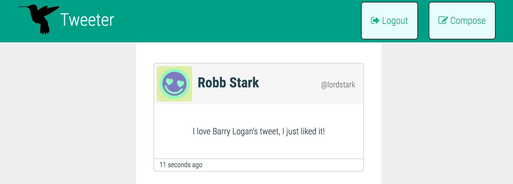

# Tweeter Project

 

Welcome to my Tweeter project! To experience a live version of this app, it's currently hosted on Heroku at http://cy-tweeter.herokuapp.com.

## Functionalities

### Dynamic Composition Box

 

An anonymous user can compose a tweet, which would allow them to post under a randomly generated user profile. The Compose Tweet box is hidden until the 'Compose' button is clicked. The character counter dynamically keeps track of the tweet's character length to keep it under 140.

### User Registration

 

A user can register a user profile, thereby allowing them to compose tweets under their own name and handle.

### Liking Tweets

 

A logged-in user can like other users' tweets (but cannot like their own). The 'like' counter will increment accordingly. The wording on the time stamp to the left of the tweet is dynamically generated on runtime. 

### Responsive Tweets

 

The app espouses a responsive design allowing it to be comfortably used on smaller screens. The above screenshot is based on an iPhone 6S screen simulation.

### Tweets Updated Automatically
The client automatically pings the server every 2 minutes to check for new tweets. It dynamically replaces the tweets' list with updated ones.

## Technologies

### Server = Express + MongoDB
The server is running on Node.js and Express, supported by MongoDB for data persistence. Instead of the baseline MongoDB Node driver, I opted for Mongoose to provide a better relational schema between the tweets and users collections. 

### Client = jQuery + SASS + Webpack
On the client side, the technologies used are Sass as a pre-compiler for CSS, and jQuery for front-side animation and minor data changes (any mission critical business logic is kept on the back-end). Both client-side JavaScript and CSS are compiled and bundled by Webpack, with a single 'bundle.js' sent to the client's browser. 

